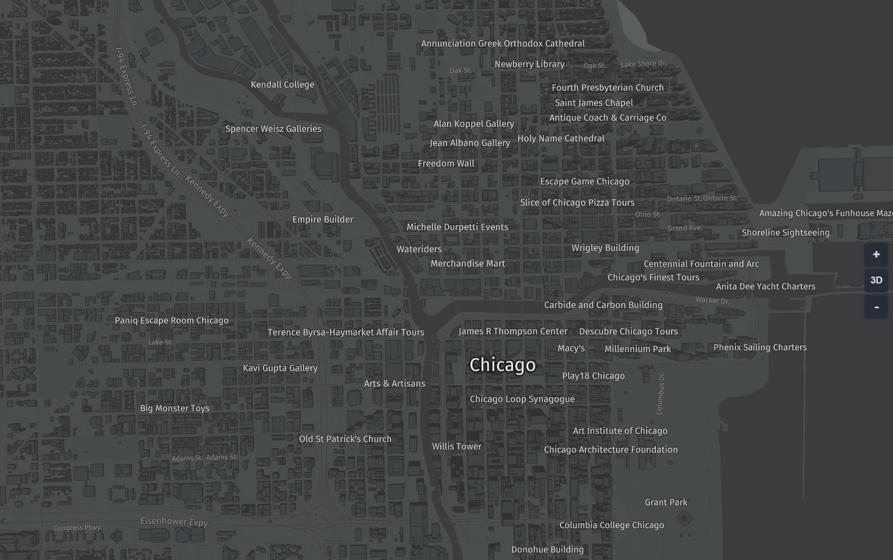
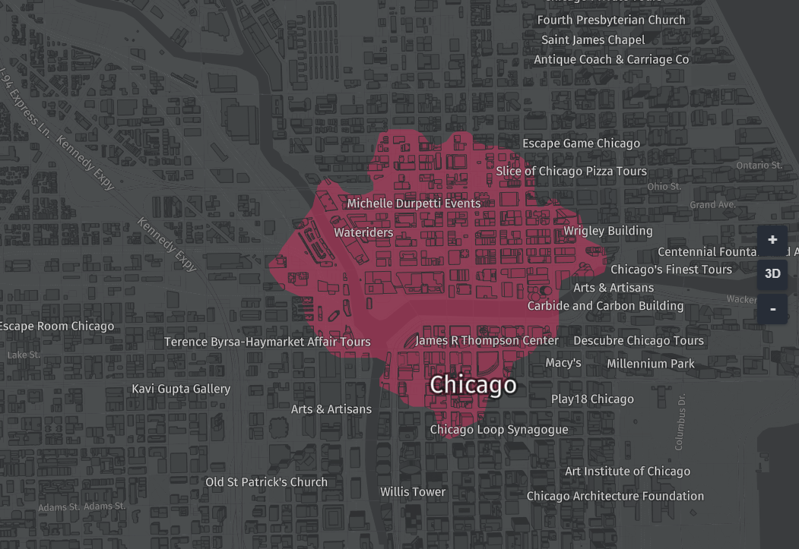
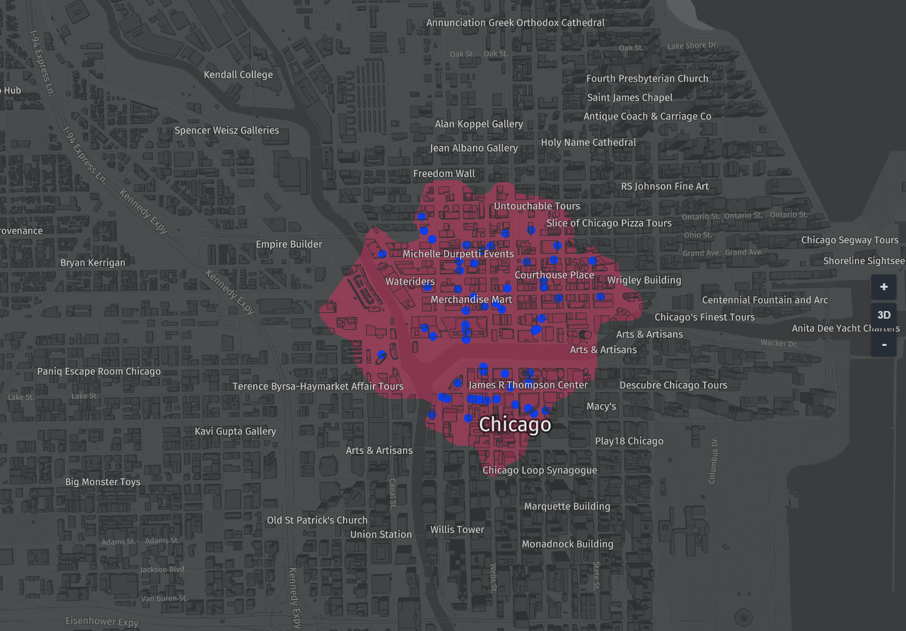

# Isoline routing using HERE Rest APIs and harp.gl

This tutorial combines harp.gl with HERE's Isoline router to display places to eat within 1KM of a location in Chicago.

harp.gl is a beta product and we are always looking to improve it with your feedback. For any comments, suggestions, or bug reports, we encourage you to create an issue on the harp.gl GitHub repository

### Become a HERE Developer

Navigate to [developer.here.com](developer.here.com)  and click Get started for free in the top right.
Create an account. No credit card is required. You will need two types of tokens one for harp.gl and one to access HERE's developer REST services.

#### harp.gl token
Once you've created a HERE Developer account, navigate to the to [HERE XYZ Token Manager](https://xyz.api.here.com/token-ui/).
Sign in with the HERE account you just created.

You'll want to generate a new token. Select the checkbox under READ DATA and then click Generate Token

#### HERE REST API's

You need to also create a REST App credentials. Create a Freemium project at [developer.here.com](https://developer.here.com/sign-up?create=Freemium-Basic&keepState=true&step=terms) and select Generate App ID and App Code

### Method 1 Linking a single script bundle to your html (recommended)

In your command line, create a new directory and navigate into it:
```
mkdir iso-line-demo
cd iso-line-demo
```
Create two files: index.html and index.js:
```
touch index.js
touch index.html
```
Copy and paste the following code into each of the files.

index.html
```html
<html>
   <head>
      <style>
         body, html { border: 0; margin: 0; padding: 0}
         #map { height: 100vh; width: 100vw; }
      </style>
      <script src="https://unpkg.com/three/build/three.min.js"></script>
      <script src="https://unpkg.com/@here/harp.gl/dist/harp.js"></script>
      <script src="https://npmcdn.com/@turf/turf/turf.min.js"></script>
   </head>
   <body>
      <canvas id="map"></canvas>
      <script src="index.js"></script>
   </body>
</html>
```
```javascript
const canvas = document.getElementById('map');
const map = new harp.MapView({
   canvas,
   theme: "https://unpkg.com/@here/harp-map-theme@latest/resources/berlin_tilezen_night_reduced.json",
   //For tile cache optimization:
   maxVisibleDataSourceTiles: 40,
   tileCacheSize: 100
});

// HERE REST Credentials

const APP_ID = "YOUR_APPID";
const APP_CODE = "YOUR_APP_CODE";

// Setting the center will use this for both isoline and Places
// in this case we will choose Chicago, IL, USA
let center = new harp.GeoCoordinates(41.8889103,-87.6365736);
map.setCameraGeolocationAndZoom(
   center,
   15
);

const mapControls = new harp.MapControls(map);
const ui = new harp.MapControlsUI(mapControls);
canvas.parentElement.appendChild(ui.domElement);

mapControls.maxPitchAngle = 75;
map.resize(window.innerWidth, window.innerHeight);
window.onresize = () => map.resize(window.innerWidth, window.innerHeight);

const omvDataSource = new harp.OmvDataSource({
   baseUrl: "https://xyz.api.here.com/tiles/herebase.02",
   apiFormat: harp.APIFormat.XYZOMV,
   styleSetName: "tilezen",
   authenticationCode: 'YOUR_XYZ_TOKEN', // YOUR HERE XYZ API Code
});
map.addDataSource(omvDataSource);

 // Isonline Section
 //////////////////////////////////////////
 // Insert isoline code from below here
 //////////////////////////////////////////

 // Places Section
 //////////////////////////////////////////
 // Insert Places code from below here
 //////////////////////////////////////////
```

NOTE: be sure to swap out YOUR-XYZ-TOKEN-HERE for the token you obtained from the XYZ Token Manager.

You can just run it with a simple server, for example in Python 2.x:
```
python -m SimpleHTTPServer 8888
```
and in Python 3.x
```
python -m http.server 8888
```
Then navigate to: [localhost:8888](http://localhost:8888)

If everything is correct you should see:


## Adding Isoline polygon

Now we want to add an isoline using [HERE's Isoline router](https://developer.here.com/documentation/routing/topics/request-isoline.html). A isoline calculates the area that can be reached in a given time or distance. The paramters are a center point and a distance. For example given a coordiante for a city and distance of 4km you can answer the question: what area can I reach by travelling no more than 4km?. There are other parameters to the isoline-router which you can find in the documentation.

Lets starts by adding the following to the *Isoline code section* above
```javascript
/// request the isonline
let url = "https://isoline.route.api.here.com/routing/7.2/calculateisoline.json?" +
    "app_id="+APP_ID+"&app_code=" + APP_CODE +
    "&mode=shortest;car;traffic:disabled" +
    "&start=geo!"+center.latitude.toString()+","+center.longitude.toString()+"&range=1000&rangetype=distance";

// create a geojson object representing the isoline route, using javascript
var isoline =  fetch(url)
   .then(response => response.json())
   .then(data => {
       return {
        type: "FeatureCollection", "features": [   
        {
        type : "Feature", geometry: { type:"Polygon", coordinates : [ data.response.isoline[0].component[0].shape.map(function(e) {
           return e.split(",").map(d => parseFloat(d)).reverse(); // swap lat/lon lon/lat
       }).reverse() ] // isoline coords are in wrong order for geojson
       } , properties: { id: data.response.isoline[0].component[0].id }} ] };
    }
);

// wait for data from Promise, add to map and style it
isoline.then(data => {

    const geoJsonDataProvider = new harp.GeoJsonDataProvider("iso-line", data);
    const geoJsonDataSource = new harp.OmvDataSource({
       dataProvider: geoJsonDataProvider,
       name: "iso-line"
    });

    map.addDataSource(geoJsonDataSource).then(() => {
        const styles = [{
           "when": "$geometryType ^= 'polygon'",
           "renderOrder": 400,
           "technique": "fill",
           "attr": {
              "color": "#D73060",
              "transparent": true,
              "opacity": 0.5,
           }
        }]

        geoJsonDataSource.setStyleSet(styles);
        map.update();

    } );
});
```
If everything is correct you should see:



The isoline router does not return geojson, instead it returns a json string of coordinates in (lat,lon) where geojon needs (lon,lat). Hence the map function above converts the json format into geojson. You can change the parameters such as the range, range type, and mode of transportation.

## Display Places within Isoline

Now let do something more analytical. We want to find all places to each within the isoline. A short overview of this process is to get all places to eat within a radius and then clip them to the isoline. The result will show all palces to eat within 1km of
downtown Chicago. 

```javascript
// Places

// get the places in this case food and drink Places within 1 km
let places_url = "https://places.cit.api.here.com/places/v1/discover/search" +
    "?in="+center.latitude.toString()+","+center.longitude.toString()+";r=1200"+ // note we make the radius a bit bigger
    "&q=food and drink" + // the category of Place
    "&app_id="+APP_ID+"&app_code="+APP_CODE +
    "&size=400"; // get a good number of results, default is 20 which is usually too small

// create the places using turf which is easier than above
var places =  fetch(places_url)
    .then(response => response.json())
    .then(data => {
        return turf.points(data.results.items.map(function(e) {
            return e.position.reverse();
        }));
    });

places.then(pois =>{
    isoline.then(isoline => {

        // clip places by isoline polygon using the pointsWithingPolygon function of turf.js
        let filtered_places = turf.pointsWithinPolygon(pois, isoline);
        const placesJsonDataProvider = new harp.GeoJsonDataProvider("filtered-places", filtered_places);
        const placesJsonDataSource = new harp.OmvDataSource({
            dataProvider: placesJsonDataProvider,
            name: "filtered-places"
        });

        // Add to the map and style
        map.addDataSource(placesJsonDataSource).then(() => {
            const styles = [{
                "when": "$geometryType ^= 'point'",
                "renderOrder": 1000,
                "technique": "circles",
                "attr": {
                    "color": "#67d7ca",
                    "size": 15,
                }
            }]

            placesJsonDataSource.setStyleSet(styles);
            map.update();

        });
    });
});
```
If everything is correct you should see:



## Wrapping up

In a few steps we showed you how to compute places to eat reachable within 1 KM of a location. You have learned:
 * Initialize a basic harp.gl map
 * Get a polygon from HERE's Isoline router
 * Get Places to Eat from HERE Places API
 * Combine the two using turf.js

Try changing some of the isoline parameters, display a list of Places sorted by distance, or combine multiple isolines and place types.

For more location technology and visualization content, follow [@heredev](http://twitter.com/heredev) on Twitter.
